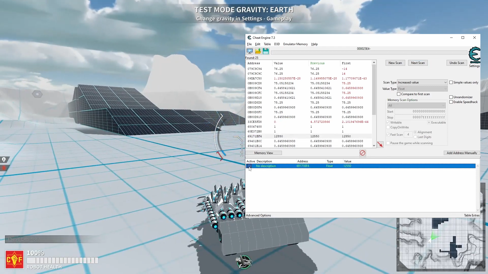

# Chamd (Chameleon DBK64)

## Modified Driver Based on Cheat Engine DBK64

This project provides a modified version of the Cheat Engine DBK64 kernel driver aimed at bypassing detection by anti-cheat systems.
It has been tested with EAC and BattlEye, potentially working with other systems as well.

Current version is based on Cheat Engine version 7.5


*As shown below, the driver successfully bypasses EAC detection in Robocraft.*

## 0. Important Warning

Even if you manage to use this driver successfully, it does not guarantee that you will not be suspected of cheating.
The usage of this software and any actions outlined in this document are entirely at your own risk.

Please note that using these instructions **poses a significant security risk** to your system.
It is highly recommended to use an isolated computer for this purpose. Additionally, isolating the machine within a local network may further enhance security.

## 1. System Requirements and Preparation
- **Operating System**: Windows 11 only. This method will not work on Windows 10.
- **Disable Anti-Virus Software**: Turn off Virus and Threat Protection in Windows settings, as well as any other anti-virus or anti-malware programs. These can block the required files
- Install **Cheat Engine 7.5** by compiling it from [source](https://github.com/cheat-engine/cheat-engine/releases/tag/7.5) or using the [installer](https://www.cheatengine.org/downloads.php).

## 2. Obtain your driver

2.1. **Download the Compiled Driver**
Visit [GitHub](https://github.com/dmarov/chamd/releases/tag/v1.4) to download the compiled driver, which includes a multibuild file.

2.2. **Extract the Archive**
Once downloaded, extract the archive containing over 1000+ drivers. This extensive number of drivers is strategically provided to minimize the chances of multiple users using the same
driver instance, thereby reducing detection risk.

2.3. **Select and Copy the Driver**
From the extracted files, choose any one random driver. Copy all three associated files to the directory where `cheatengine-x86_64.exe` is located.

---

Why Multiple Drivers?
Using a unique driver decreases the chances of your setup being flagged or blacklisted by anti-cheat systems.
The way anti-cheat works, is that it develops signatures for popular cheats and flags it in the database. Of cousre there's more to anti-cheat.

---

For better reliability, consider compiling your own driver following the instructions in Section 7. This process creates a custom driver, reducing the chances of
detection.


## 3. Bypassing **Digital Signature Enforcement**

At this point you have driver signed with untrusted certificate.
There are a few options to load it.
In this section the method based on bypass of **Patchguard** and **Digital Signature Enforcement** will be explained.
Refer to section 8 for some extra method.

- [Video tutorial 1](https://www.youtube.com/watch?v=EJGuJp2fqpM)
- [Video tutorial 2](https://www.youtube.com/watch?v=zsw3xoG3zgs)


3.1. Create bootable usb drive

3.1.1. Download and extract the [archive](https://github.com/Mattiwatti/EfiGuard/releases/download/v1.4/EfiGuard-v1.4.zip).

3.1.2. Mount you usb drive. 2GB drive should be more than enough.

3.1.3. Format your usb drive as `FAT32`. **be carefull to format the correct device**, because it will erase all data on USB drive

3.1.4. Partition your device as bootable `GPT` with `EFI` partition.
**be carefull to partition the correct device!!!**

Open command prompt as administrator and perform the following commands:

```shell
diskpart
list disk // detect your USB drive
select disk {put number of your USB drive here} // SELECTING CORRECT DISK!!!
list disk // make sure correct disk is selected
clean // wipe out your drive
create partition primary size=512 // create EFI partition
list partitions // created partition shoud be displayed
select partition 1 // select created partition
active // mark partition as active
format quick fs=fat32 // create filesystem
assign // disk should be mounted
exit
```

3.1.5. Copy files to USB drive

Copy `EFI` directory from the extracted archive to the root of created partition.

3.1.6. Rename bootloader

Locate `EFI/Boot/Loader.efi` on the USB drive, than rename it to `EFI/Boot/bootx64.efi`.

3.2. Boot your system from USB drive.

Restart your computer and enter the UEFI settings (usually by pressing F2, F12, or DEL during startup).
Set the first boot option to your USB drive (UEFI). The second option should be your windows drive (UEFI).
Ensure Secure Boot is disabled since EFIGuard rootkit isn't signed.

3.3. Copy files for digital signature enforcement bypass

3.3.1. In the directory containing `cheatengine-x86_64.exe`, create a new file named `run.bat` with the following content:

```shell
"%~dp0\EfiDSEFix.exe" -d
start /d "%~dp0" cheatengine-x86_64.exe
timeout /t 20
"%~dp0\EfiDSEFix.exe" -e
```

Before doing that, make sure that file explored is not configured to hide known file extensions.

3.3.2. Copy `EfiDSEFix.exe` from the archive to the same directory as `cheatengine-x86_64.exe`.

## 4. Configure Cheat Engine

Make sure that

`Edit` > `Settings` > `Extra` > `Query memory region routines` is checked

`Edit` > `Settings` > `Extra` > `Read/Write process memory` is checked

Click `OK`.

It might end up with errors. Close Cheat Engine.

## 5. Run Cheat Engine.

### If you followed section 3:

Run `run.bat` as Administrator.

Do not close the window that pops out manually!!! Wait for it to close automatically.

After the driver has been successfully loaded, you can directly run `cheatengine-x86_64.exe` without needing to execute `run.bat`.

### If you followed section 8:

Run `cheatengine-x86_64.exe`

## 6. Congratulations

You have successfully loaded the DBK64 driver signed with an untrusted certificate.
This allows kernel mode anti-cheat (EAC) to permit starting the game and performing operations on the
game memory. Note: The last tested version was confirmed on EAC as of April 19, 2025.

## 7. [Optional] Compile the driver from source

Anti-cheat systems may collect signatures of suspicious drivers used by a small number of users to block them. To mitigate this, it is recommended to compile your own version of the
driver with a unique signature.

#### **Note:**
Use PowerShell or Cmder for these steps.

[Video Tutorial](https://www.youtube.com/watch?v=7ARwpxZPpE8)

7.1. Clone this repository

```shell
git clone https://github.com/dmarov/chamd.git
cd chamd
```

Ensure you have Git installed on your system before cloning.

7.2. Install [nodejs](https://nodejs.org/en/). Version `>=19` is required.

7.3. Install packages
Run the following command in your terminal:

```shell
npm install
```

This will install all required packages for building the driver.

7.4. Copy `.env.tpl` to `.env`
Create a copy of the template environment file by running:

```shell
cp .env.tpl .env
```

7.5. Optionaly set `CHAMD_DBK_DRIVER_NAME` in `.env`.

Edit the `.env` file and set the `CHAMD_DBK_DRIVER_NAME` variable to a unique name if desired.

Example:
```env
CHAMD_DBK_DRIVER_NAME=mysupercooldrv
```

7.6. Install Visual Studio

Install **Visual Studio 2022** (Community or Enterprise) with support for C++ development.

[Download Visual Studio](https://visualstudio.microsoft.com/downloads/)

Ensure you select the following components during installation:
- **Desktop Development with C++**
- **MSVC v143 (C++ Compiler)**

7.7. Install [Windows SDK and WDK](https://docs.microsoft.com/en-us/windows-hardware/drivers/download-the-wdk)
Carefully follow the instructions from the link. It is important that SDK and WDK have the same version.
Correct versions of spectre mitigated libraries should be installed in the process.

7.8. Install openssl. The most straightforward way is to use Chocolatey package manager.

```shell
choco install openssl
```

This command has to be performed as Admininstrator.

7.9. Run build

```shell
npm run all
```

Note:

You can use [EV certificate](https://learn.microsoft.com/en-us/windows-hardware/drivers/dashboard/code-signing-cert-manage)
to sign driver. You could skip digital signature enforcement bypass this way. They are costly though and can be revoked when misused.

7.10. Copy all files from the 'dist' directory to directory where `cheatengine-x86_64.exe`
is located.

7.11. If you've managed to compile this driver successfully and want to share few
randomized copies then run `npm run multibuild 10`. `dist` directory will
contain `10` randomized drivers.

Then go to section 3.

## 8. [Optional] Another Method of dealing with *Digital Signature Enforcement*

If you want to bypass digital signature enforcement temporarily (for testing purposes only), follow these steps:

8.1. Enable Test Signing Mode:
```shell
bcdedit /set testsigning on
```
This command modifies the boot configuration to allow loading of unsigned or self-signed drivers.

8.2. Reboot Your System:
The changes take effect after a system reboot.

8.3. Proceed with Section 4:
Load the driver as outlined in section 4.

8.4. Disable Test Signing Mode:
After testing, disable test signing mode to restore normal security settings.
```shell
bcdedit /set testsigning off
```

---

Enabling test signing mode is intended for development and troubleshooting purposes only.
It temporarily reduces the system's security by allowing unsigned drivers to load.
This method does not work with anti-cheat systems, as they typically enforce strict driver signature requirements.
